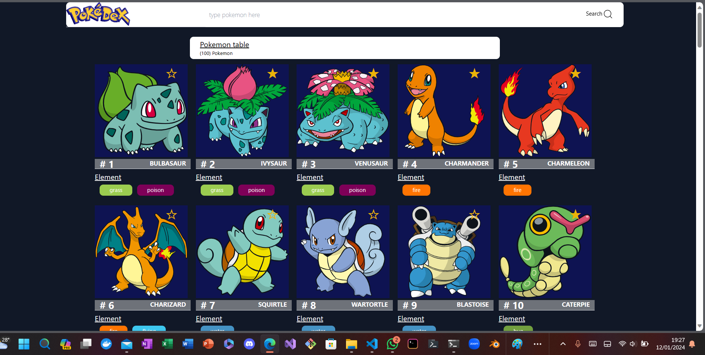
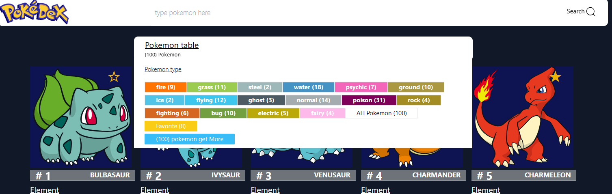
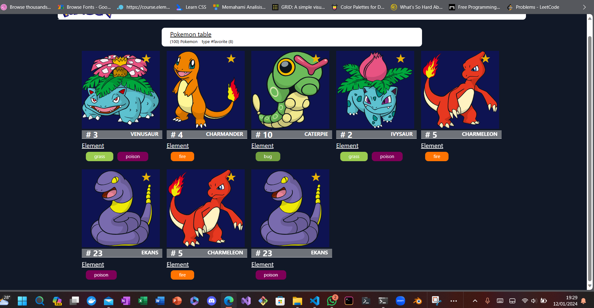
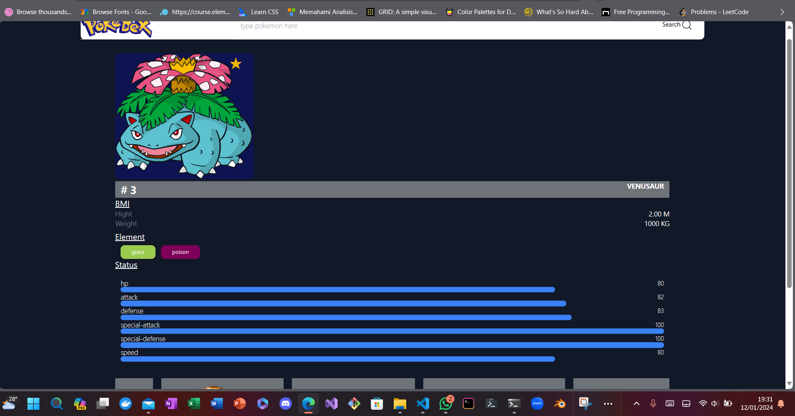

<<<<<<< HEAD

=======

# Read mee 😎😎😎 Simple Pokedex Applications

## [Link to app deployed at netlify ](https://notetodonet.netlify.app/)

### Main UI

#### Home

> Filter table
> 
> Favorite pokemon
> 
> Pokemon pages
> 

> this App use Zustand as state global data management and Index DB as browser data base to store pokemon data and reduce unnecessary fetching data

https://youtu.be/cchqeWY0Nak?si=hTlJ-9A9R9ocU_rH
